# 🔄 AI Recruitr - Workflow & Architecture

This document provides a comprehensive overview of AI Recruitr's architecture, workflows, and component interactions using visual diagrams.

## 📋 Table of Contents

- [System Architecture](#system-architecture)
- [Component Overview](#component-overview)
- [Resume Processing Workflow](#resume-processing-workflow)
- [Job Matching Workflow](#job-matching-workflow)
- [API Request Flow](#api-request-flow)
- [Data Flow Architecture](#data-flow-architecture)
- [User Journey Flow](#user-journey-flow)
- [Service Dependencies](#service-dependencies)
- [Database Schema](#database-schema)
- [Deployment Architecture](#deployment-architecture)

---

## 🏗️ System Architecture

### High-Level Architecture Overview

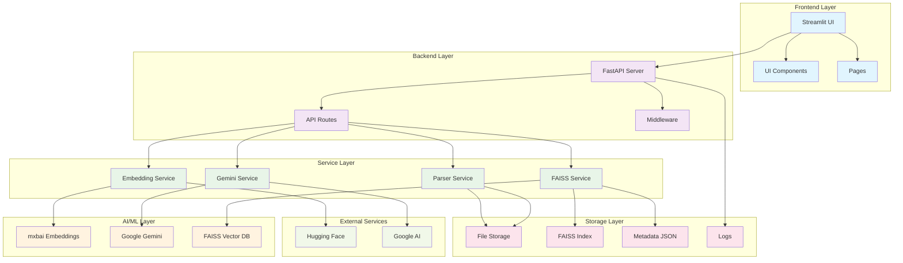

---

## 🧩 Component Overview

### Core Components & Responsibilities

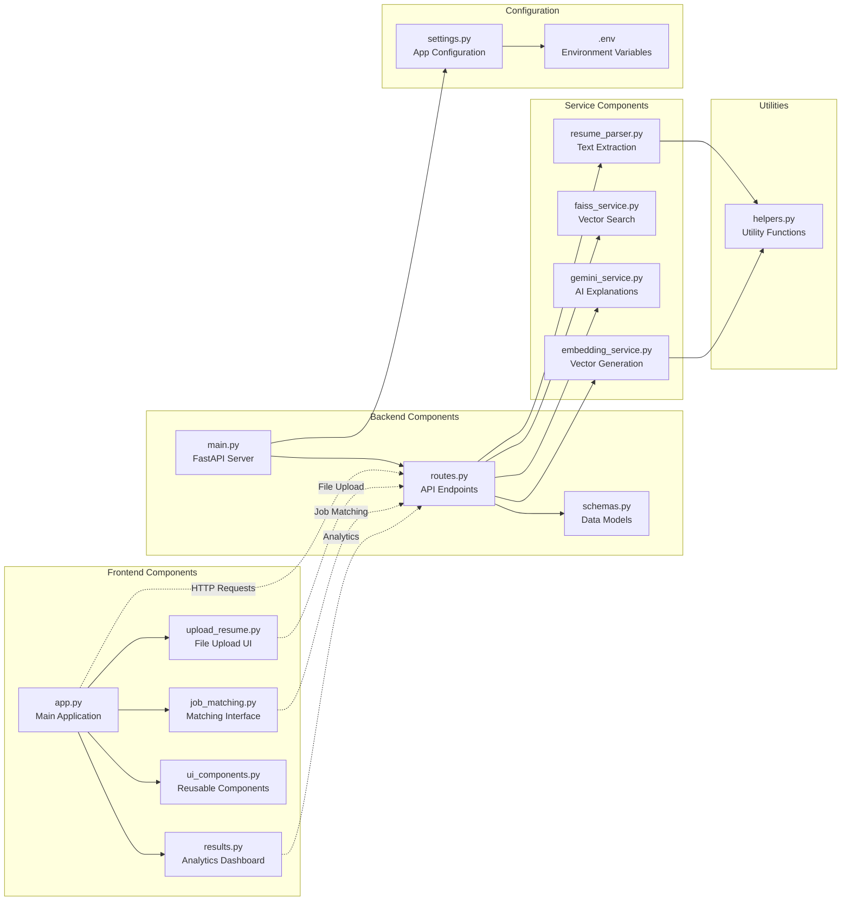

---

## 📄 Resume Processing Workflow

### Complete Resume Upload & Processing Flow

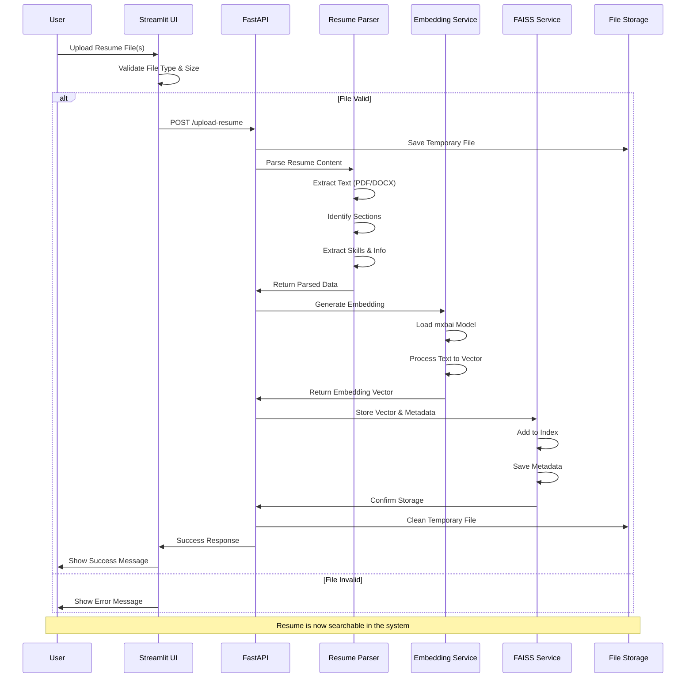

### Resume Parsing Detail Flow

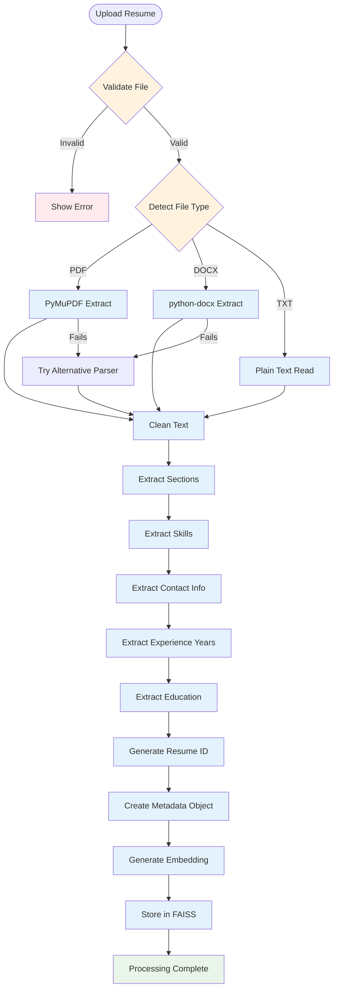

---

## 🎯 Job Matching Workflow

### Complete Job Matching Process

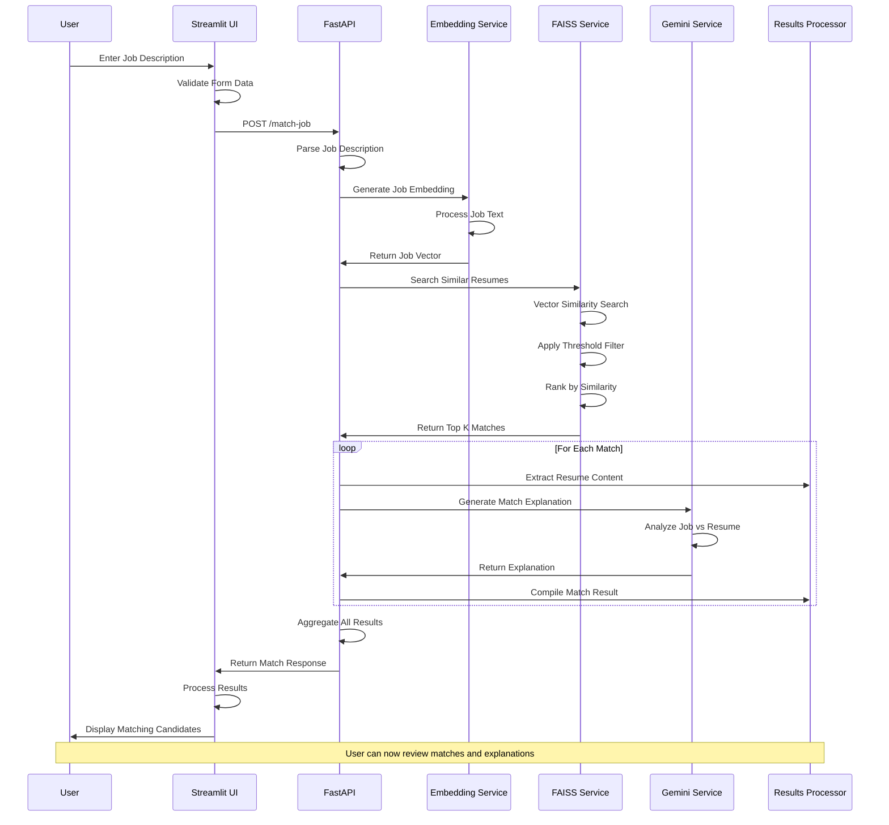

### Detailed Matching Algorithm

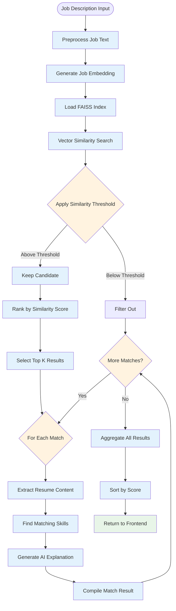

---

## 🔗 API Request Flow

### REST API Endpoints & Flow

```mermaid
graph TD
    subgraph "Client Requests"
        UPLOAD_REQ[POST /upload-resume]
        MATCH_REQ[POST /match-job]
        COUNT_REQ[GET /resumes/count]
        STATUS_REQ[GET /]
        HEALTH_REQ[GET /health]
    end
    
    subgraph "API Gateway"
        FASTAPI[FastAPI Server<br/>Port 8000]
        CORS[CORS Middleware]
        LOGGING[Request Logging]
        ERROR_HANDLER[Error Handler]
    end
    
    subgraph "Route Handlers"
        UPLOAD_HANDLER[upload_resume()]
        MATCH_HANDLER[match_job_to_resumes()]
        COUNT_HANDLER[get_resume_count()]
        STATUS_HANDLER[get_status()]
        HEALTH_HANDLER[health_check()]
    end
    
    subgraph "Service Layer"
        PARSER_SVC[Resume Parser]
        EMBED_SVC[Embedding Service]
        FAISS_SVC[FAISS Service]
        GEMINI_SVC[Gemini Service]
    end
    
    subgraph "Responses"
        SUCCESS_RESP[200 Success]
        ERROR_RESP[400/500 Error]
        JSON_RESP[JSON Response]
    end
    
    %% Request flow
    UPLOAD_REQ --> FASTAPI
    MATCH_REQ --> FASTAPI
    COUNT_REQ --> FASTAPI
    STATUS_REQ --> FASTAPI
    HEALTH_REQ --> FASTAPI
    
    %% Middleware
    FASTAPI --> CORS
    CORS --> LOGGING
    LOGGING --> ERROR_HANDLER
    
    %% Route handling
    ERROR_HANDLER --> UPLOAD_HANDLER
    ERROR_HANDLER --> MATCH_HANDLER
    ERROR_HANDLER --> COUNT_HANDLER
    ERROR_HANDLER --> STATUS_HANDLER
    ERROR_HANDLER --> HEALTH_HANDLER
    
    %% Service calls
    UPLOAD_HANDLER --> PARSER_SVC
    UPLOAD_HANDLER --> EMBED_SVC
    UPLOAD_HANDLER --> FAISS_SVC
    
    MATCH_HANDLER --> EMBED_SVC
    MATCH_HANDLER --> FAISS_SVC
    MATCH_HANDLER --> GEMINI_SVC
    
    COUNT_HANDLER --> FAISS_SVC
    
    %% Responses
    UPLOAD_HANDLER --> SUCCESS_RESP
    MATCH_HANDLER --> SUCCESS_RESP
    COUNT_HANDLER --> SUCCESS_RESP
    STATUS_HANDLER --> SUCCESS_RESP
    HEALTH_HANDLER --> SUCCESS_RESP
    
    ERROR_HANDLER --> ERROR_RESP
    
    SUCCESS_RESP --> JSON_RESP
    ERROR_RESP --> JSON_RESP
```

### API Response Structure

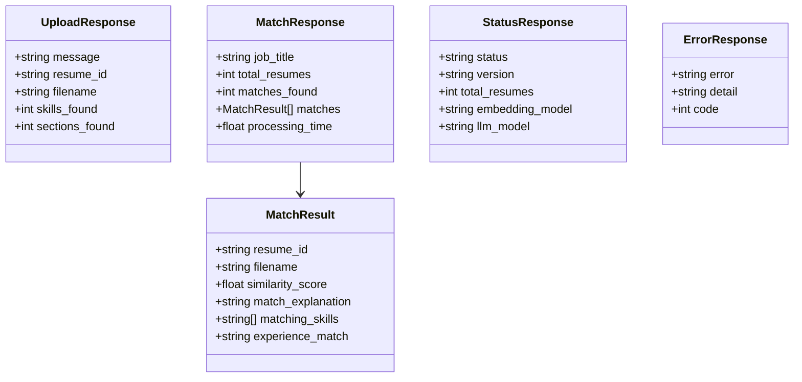

---

## 📊 Data Flow Architecture

### System Data Flow

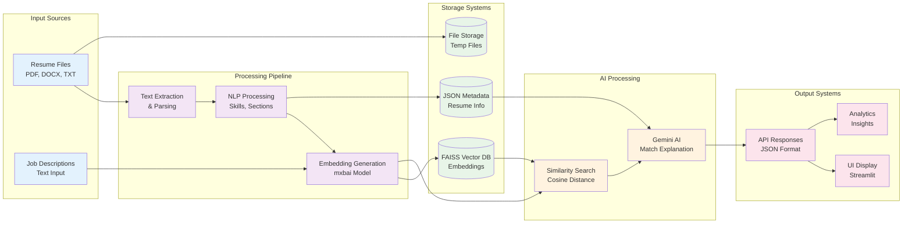

### Vector Processing Pipeline

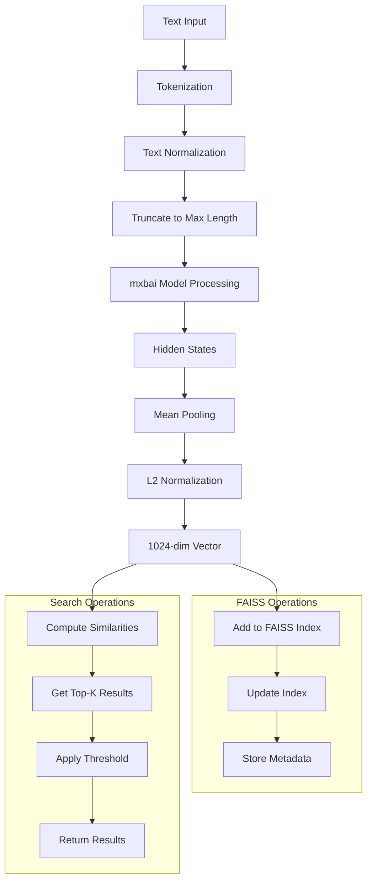

---

## 👤 User Journey Flow

### Complete User Experience Flow

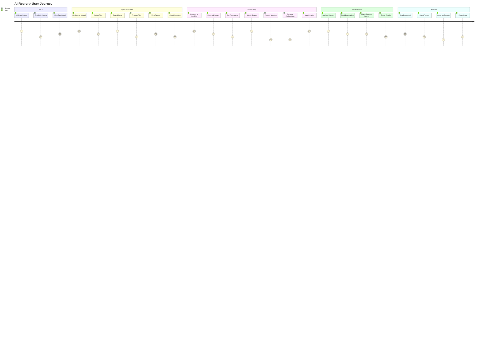

### User Interface Navigation Flow

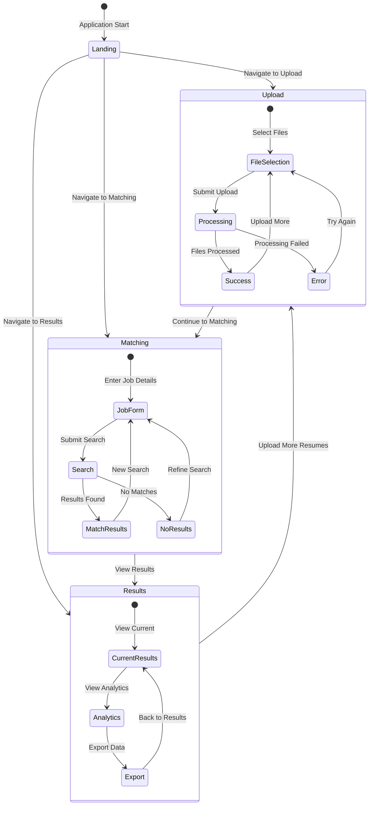

---

## 🔧 Service Dependencies

### Service Dependency Graph

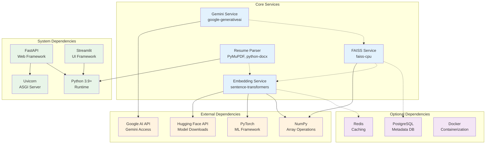

### Initialization Sequence

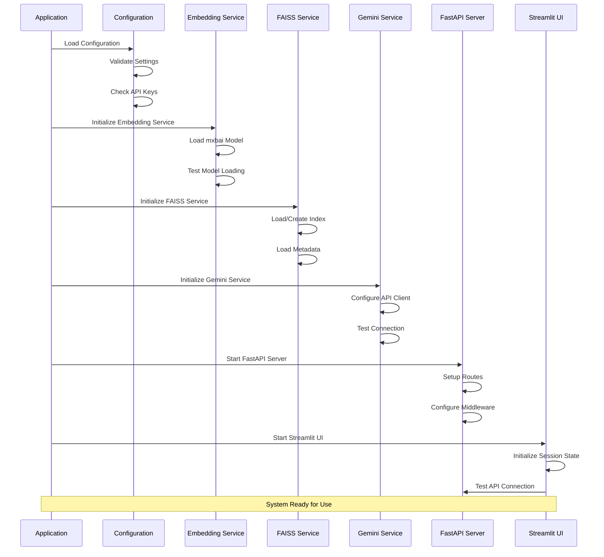

---

## 🗄️ Database Schema

### FAISS Index Structure

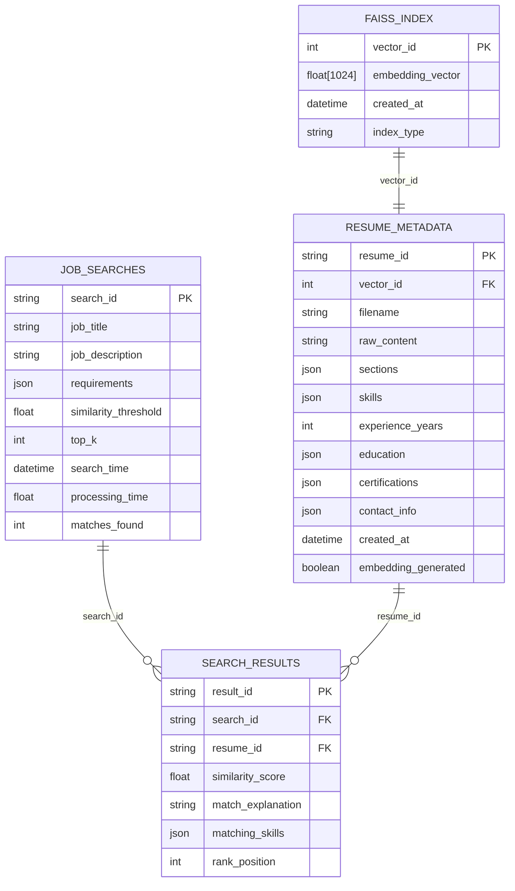

### Data Storage Architecture

```mermaid
graph TB
    subgraph "File System Storage"
        UPLOADS[/uploads/<br/>Temporary Files]
        FAISS_FILES[/data/faiss_index/<br/>Index Files]
        METADATA_JSON[/data/faiss_index/<br/>metadata.json]
        LOGS[/logs/<br/>Application Logs]
    end
    
    subgraph "In-Memory Storage"
        SESSION[Streamlit Session State]
        CACHE[Model Cache]
        INDEX_CACHE[FAISS Index Cache]
    end
    
    subgraph "Optional External Storage"
        REDIS_CACHE[(Redis Cache)]
        POSTGRES_DB[(PostgreSQL)]
        S3_STORAGE[(AWS S3)]
    end
    
    %% File system connections
    UPLOADS --> METADATA_JSON
    FAISS_FILES --> INDEX_CACHE
    METADATA_JSON --> SESSION
    
    %% Optional connections
    CACHE -.-> REDIS_CACHE
    METADATA_JSON -.-> POSTGRES_DB
    UPLOADS -.-> S3_STORAGE
    
    %% Styling
    classDef filesystem fill:#e3f2fd
    classDef memory fill:#e8f5e8
    classDef external fill:#fff3e0
    
    class UPLOADS,FAISS_FILES,METADATA_JSON,LOGS filesystem
    class SESSION,CACHE,INDEX_CACHE memory
    class REDIS_CACHE,POSTGRES_DB,S3_STORAGE external
```

---

## 🚀 Deployment Architecture

### Container Architecture

```mermaid
graph TB
    subgraph "Docker Containers"
        subgraph "Frontend Container"
            STREAMLIT[Streamlit App<br/>Port 8501]
            UI_FILES[UI Components]
        end
        
        subgraph "Backend Container"
            FASTAPI[FastAPI Server<br/>Port 8000]
            SERVICES[AI Services]
        end
        
        subgraph "Cache Container"
            REDIS_CONT[Redis Cache<br/>Port 6379]
        end
        
        subgraph "Reverse Proxy"
            NGINX[Nginx<br/>Port 80/443]
        end
    end
    
    subgraph "External Services"
        HF_MODELS[Hugging Face<br/>Models]
        GEMINI_API[Google Gemini<br/>API]
    end
    
    subgraph "Storage Volumes"
        DATA_VOL[/data Volume<br/>FAISS Index]
        LOGS_VOL[/logs Volume<br/>Application Logs]
    end
    
    %% Container connections
    NGINX --> STREAMLIT
    NGINX --> FASTAPI
    STREAMLIT -.->|API Calls| FASTAPI
    FASTAPI --> REDIS_CONT
    
    %% External connections
    SERVICES --> HF_MODELS
    SERVICES --> GEMINI_API
    
    %% Volume connections
    FASTAPI --> DATA_VOL
    FASTAPI --> LOGS_VOL
    STREAMLIT --> LOGS_VOL
    
    %% Styling
    classDef container fill:#e3f2fd
    classDef external fill:#fff3e0
    classDef storage fill:#e8f5e8
    
    class STREAMLIT,UI_FILES,FASTAPI,SERVICES,REDIS_CONT,NGINX container
    class HF_MODELS,GEMINI_API external
    class DATA_VOL,LOGS_VOL storage
```

### Production Deployment Flow

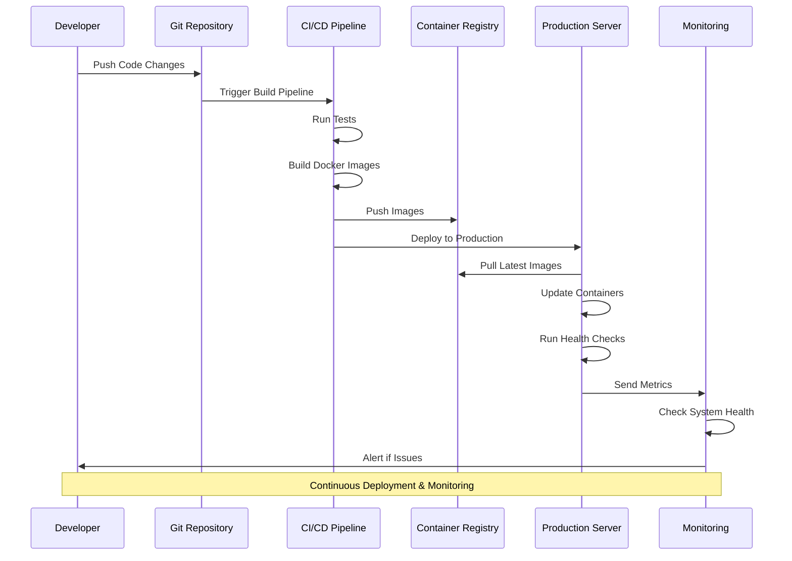

---

## 📈 Performance & Scaling

### Performance Optimization Points

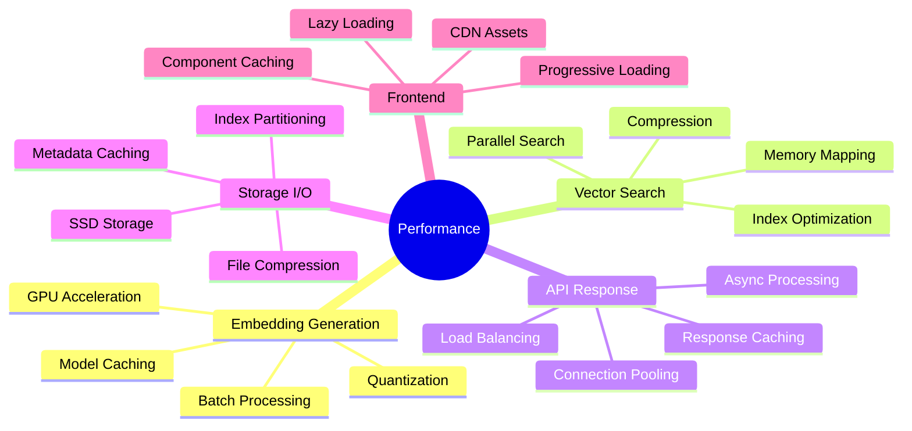

### Scaling Architecture

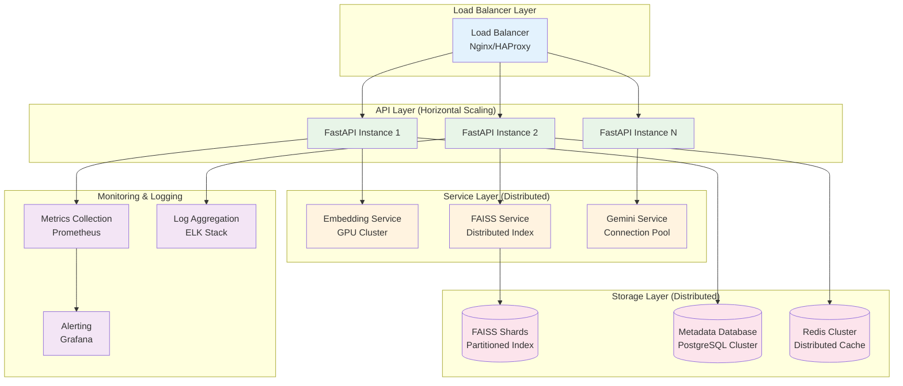

---

## 🔄 Development Workflow

### Development & Testing Flow

```mermaid
gitgraph
    commit id: "Initial Setup"
    
    branch feature/embedding-service
    checkout feature/embedding-service
    commit id: "Add mxbai model"
    commit id: "Add fallback models"
    commit id: "Unit tests"
    
    checkout main
    merge feature/embedding-service
    
    branch feature/faiss-integration
    checkout feature/faiss-integration
    commit id: "FAISS service"
    commit id: "Vector operations"
    commit id: "Integration tests"
    
    checkout main
    merge feature/faiss-integration
    
    branch feature/streamlit-ui
    checkout feature/streamlit-ui
    commit id: "Upload UI"
    commit id: "Matching UI"
    commit id: "Results UI"
    commit id: "E2E tests"
    
    checkout main
    merge feature/streamlit-ui
    
    commit id: "Production Release v1.0"
```

---

This comprehensive workflow documentation provides a complete understanding of AI Recruitr's architecture, data flows, and operational processes. Each diagram illustrates different aspects of the system to help developers, operators, and stakeholders understand how the components work together to deliver intelligent resume matching capabilities.